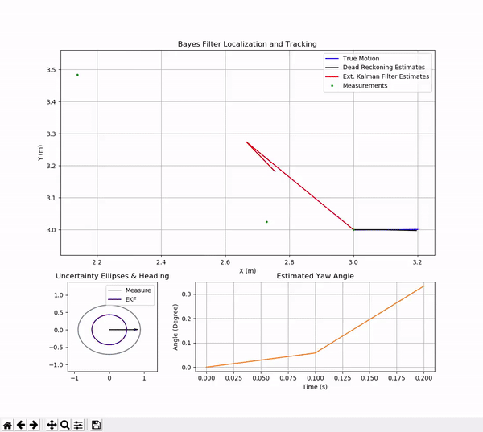

# BayesRobotLoc

This is a C++11 simulation of Bayes filters (a.k.a. Recursive Bayes Estimation) for robot localization described in the book [Probabilistic Robotics](http://www.probabilistic-robotics.org/).
 A simulation demo shows extended Kalman filter for position tracking with known correspondences, in comparison with dead reckoning navigation technique.
 Artificial Gaussian noise is assumed and added in both control variables and measurements.

####  Position tracking with the extended Kalman filter:
</img>

Requirements
------------

* [Eigen](http://eigen.tuxfamily.org) >= 3.3.7
* [matplotlib-cpp](https://github.com/lava/matplotlib-cpp)
* python3-dev
* python3-numpy
* python3-matplotlib

Usage
-----

On Ubuntu 20.04, install libraries:

`sudo apt install libeigen3-dev python3-dev python-numpy python-matplotlib`

Build:

`g++ ekf_loc.cpp run.cpp -o run -std=c++11 -I/usr/include/eigen3 -I/usr/include/python3.8 -lpython3.8`

Run the simulation: `./run`

Reference
-------------
* `Probabilistic Robotics`, Table 7.2 The extended Kalman filter (EKF) localization algorithm, page 204.
